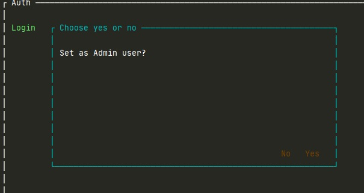

# Бази даних 2. БД на основі XML: Лабораторна робота 2: Практичне використання сервера Redis

Василець Д. КП-83

Варіант 2

Було створено дві окремих структури даних SET-а для представлення двух груп 
користувачів системи: адміністраторів та звичайних користувачів.
Перевага SET у тому, що пошук даних у ній здійснюється за константний час, 
що дуже зручно при основних операціях для користувачів: треба швидко діставати 
дані про користувача під час аутентифікації. 

Є потреба переглядати відсортований рейтинг користувачів, тому, для цього функціоналу використано
структуру ZSET, адже вона зберігає дані відсортованими по певному ключу.

Повідомлення зберігаються за допомогою HASH, адже у цій структурі даних набори зберігаються як ключ-значення. Ключ генерується за 
допомогою інкременту типу string.

Журнал повідомлень реалізовано Pub/Sub: кожен вдправник повідомлення стає publisher,
а кожен subscriber отримує його повідомлення.

Для черги повідомлень та відображення користувачу його власних вхідних повідомлень використано LIST з метою збереження порядку даних. Ще одною перевагою 
LIST у даному випадку є те, що вилучення даних з кінця та додавання їх на початок відбувається за сталий час.

Для того, щоб користувач зміг отримати статистику по статусам відправлених повідомлень, було відповідно сторено SET для кожного статусу. 
Для зберігання відправлених користувачем повідомлень був також створений SET. 
Для групування, використано операції об'єднання множин статусів, 
потім робиться перетин утвореної множини з множиною відправлених повідомлень, що
дає змогу швидко порахувати відповідну кількість.

## Результати роботи

